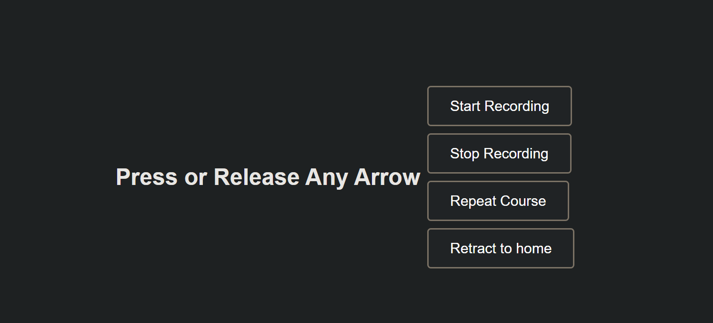

# NavigAItor: The AI-Powered Autonomous Path Navigator

## Overview
NavigAItor is an intuitive, AI-driven robot designed to autonomously navigate along a pre-recorded path. With simple button controls, it can move forward, backward, left, or right – all without the need for GPS or complex algorithms. Instead, NavigAItor uses pure intelligence to understand its environment.

By capturing images and creating a video-based map, NavigAItor constructs a "path story," similar to how a person might walk a trail, marking key landmarks to ensure they can retrace their steps. At the heart of this process, a neural network integrates interest point detection and descriptor extraction into a single, efficient model.

### Key Features
- **Remote Control**: Manage the Raspbot’s movement via a web-based server GUI.
- **Snapshot Capture**: Automatically take snapshots along the drive path for documentation.
- **AI-Powered Path Repetition**: Allow the robot to retrace its recorded path using only camera input, with no manual control.

## Installation

To get started with NavigAItor, follow these steps:

### Prerequisites
1. Get the Raspbot V2 AI Vision Robot Car for Raspberry Pi 5 and Raspberry Pi AI HAT+.

2. Launch & install basic flows for the Robot and AI-Kit according to manuals

3. Clone the repository:
    ```bash
    git clone https://github.com/eilonpo/navigaitor/
    cd community_projects/Navigaitor/
    ```
4. Install dependencies:
    - Ensure you have **pipx** and **poetry** for managing dependencies:
    ```bash
    sudo apt install pipx
    pipx install poetry
    export PATH="$HOME/.local/bin:$PATH"  # Add poetry's bin dir to PATH
    poetry install  # This will create a virtual environment and install dependencies
    ```

5. Set up the environment:
    ```bash
    # Create and activate the virtual environment
    . ../../setup_env.sh
    pip install torch opencv-python onnxruntime tqdm
    ```

6. Connect to your Raspbot:
    - Get the Raspbot’s IP address from the display.
    - Open a browser and navigate to the Raspbot server: `http://<ip_addr>:8000`.



## Usage

1. **Record a Path**:  
   - Start recording mode and guide the robot along the desired path.
   - Stop recording when finished.
   
2. **Navigate and Retrace**:  
   - Use the navigation buttons to bring the robot back to the starting point.
   - Activate "retreat mode" and watch the robot retrace its recorded path.

## Future Enhancements
- **Path Library**: Store and retrieve multiple paths of interest.
- **Reverse Path Navigation**: Retrace any recorded path in the reverse direction.
- **Start Anywhere**: Begin from any point along a recorded path.
- **Remote Monitoring**: Stream the Raspbot’s point of view (POV) in real-time, displaying the path as it’s retraced.
